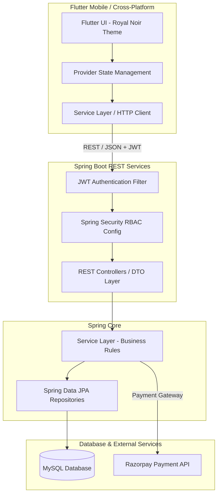

# 🏥 MediCarePlus — Enterprise Full-Stack Healthcare Platform

[](https://flutter.dev)
[](https://spring.io/projects/spring-boot)
[](https://www.oracle.com/java/)
[](https://www.mysql.com/)
[](https://jwt.io/)
[](https://razorpay.com/)

MediCarePlus is a production-grade, multi-role healthcare appointment management and telemedicine platform. It bridges Patients, Healthcare Providers (Doctors), and System Administrators through a secure RESTful Spring Boot microservice backend and a high-performance, cross-platform Flutter application.

---

## 🌟 Why MediCarePlus? (Engineering Highlights)

This project was built to demonstrate production-ready software engineering practices, clean architectural principles, and enterprise-grade security:

- 🔒 **Enterprise Security & Stateless Auth**: Implements JWT-based authentication with Spring Security filter chains, BCrypt password hashing, and granular Role-Based Access Control (RBAC).
- ⚡ **Scalable Layered Architecture**: Engineered using the Controller-Service-Repository pattern with Spring Data JPA/Hibernate ORM and DTO mapping to enforce decoupling and maintainability.
- 💳 **Payment Gateway Integration**: Integrated Razorpay checkout flow for appointment consultation fee processing.
- 🎨 **Royal Noir Design System**: Features a custom Flutter UI design system with Google Fonts, custom color tokens, micro-interactions, and Shimmer loading states.
- 🛡️ **Verification Workflow**: Administrative approval pipelines for verifying doctor credentials before public listing.

---

## 📐 System Architecture



---

## 📱 Application Showcase & Screenshots

<div align="center">

### 1️⃣ Patient Experience
| Doctor Discovery & Search | Slot Selection & Booking | Razorpay Checkout |
| :---: | :---: | :---: |
|  |  |  |

### 2️⃣ Doctor & Administrator Portals
| Doctor Analytics Dashboard | Time Slot Management | Admin Doctor Approval |
| :---: | :---: | :---: |
|  |  |  |

</div>

---

## 👤 Role-Based Capabilities

### 1️⃣ Patient Portal
- **Authentication**: JWT-backed secure Sign Up & Login.
- **Doctor Discovery**: Search & real-time filter by doctor name, medical specialization, experience, and ratings.
- **Appointment Booking**: Real-time availability slot selection and booking pipeline.
- **Payment Integration**: Secure consultation payment via Razorpay.
- **Appointment Tracker**: Categorized view for `Upcoming`, `Completed`, and `Cancelled` appointments.

### 2️⃣ Doctor Portal
- **Dashboard Analytics**: Real-time operational metric cards (Pending, Completed, and Total consultations).
- **Daily Schedule View**: Detailed chronological daily appointment roster.
- **Slot & Schedule Management**: Interactive UI for setting up active working days and available time slots.

### 3️⃣ Admin Console
- **System Metrics Overview**: High-level platform statistics (Total Patients, Verified Doctors, Total Revenue/Appointments).
- **Doctor Credential Verification**: Dedicated approval workflow to inspect and verify newly registered medical practitioners before public onboarding.

---

## 🛠️ Technology Stack

| Domain | Technology / Library | Purpose |
| :--- | :--- | :--- |
| **Frontend Framework** | Flutter SDK 3.x / Dart | Cross-platform mobile & desktop UI |
| **State Management** | Provider | Reactive state & dependency injection |
| **Backend Framework** | Spring Boot 3.2 (Java 17) | RESTful microservice backend |
| **Security & Auth** | Spring Security 6 + JJWT | Stateless authentication & RBAC |
| **Database & ORM** | MySQL 8.0 + Spring Data JPA | Relational data persistence & ORM |
| **Payment Integration**| Razorpay Flutter SDK | Secure checkout & payment handling |
| **Build Tools** | Maven (Backend) / Flutter CLI | Dependency management & packaging |

---

## 🔌 API Endpoints Summary

| Method | Endpoint | Access | Description |
| :--- | :--- | :--- | :--- |
| `POST` | `/api/auth/register` | Public | Register new Patient or Doctor account |
| `POST` | `/api/auth/login` | Public | Authenticate user & return JWT token |
| `GET` | `/api/doctors` | Patient, Admin | Retrieve list of approved doctors |
| `GET` | `/api/doctors/specialization/{type}` | Patient | Filter doctors by medical domain |
| `POST` | `/api/appointments/book` | Patient | Book appointment slot |
| `GET` | `/api/appointments/my-appointments` | Patient / Doctor | Get role-specific appointment history |
| `POST` | `/api/appointments/cancel/{id}` | Patient | Cancel an upcoming booking |
| `GET` | `/api/admin/pending-doctors` | Admin | Fetch unverified doctor registrations |
| `PUT` | `/api/admin/approve-doctor/{id}` | Admin | Approve doctor for public listing |

---

## 🚀 Getting Started

### Prerequisites
- **JDK 17** or higher
- **Maven 3.8+**
- **Flutter SDK 3.10+**
- **MySQL Server 8.0+**

### 1. Database Configuration
Create a MySQL database named `medicareplus`:
```sql
CREATE DATABASE medicareplus;
```
Configure your database credentials in `backend/src/main/resources/application.properties`:
```properties
spring.datasource.url=jdbc:mysql://localhost:3306/medicareplus
spring.datasource.username=YOUR_MYSQL_USERNAME
spring.datasource.password=YOUR_MYSQL_PASSWORD
spring.jpa.hibernate.ddl-auto=update
```

### 2. Backend Setup
```bash
cd backend
mvn clean install
mvn spring-boot:run
```
*The Spring Boot server starts at `http://localhost:8080`.*

### 3. Frontend Setup
```bash
cd frontend
flutter pub get
flutter run
```

---

## 💼 Developer Information & Contact

**Developed by:** *Ashish Gaikwad*  
📧 **Email:** *ashishgaikwad9561@gmail.com*  
🔗 **LinkedIn:** *https://www.linkedin.com/in/ashish9561/*  
🌐 **Portfolio:** *https://github.com/ashish956175/*

---
*⭐ If you find this project impressive or helpful, feel free to give it a star! Open to Full-Stack / Mobile / Backend Software Engineering opportunities.*
